# Remote development on AWS

### 1. Launch instance, with desired settings
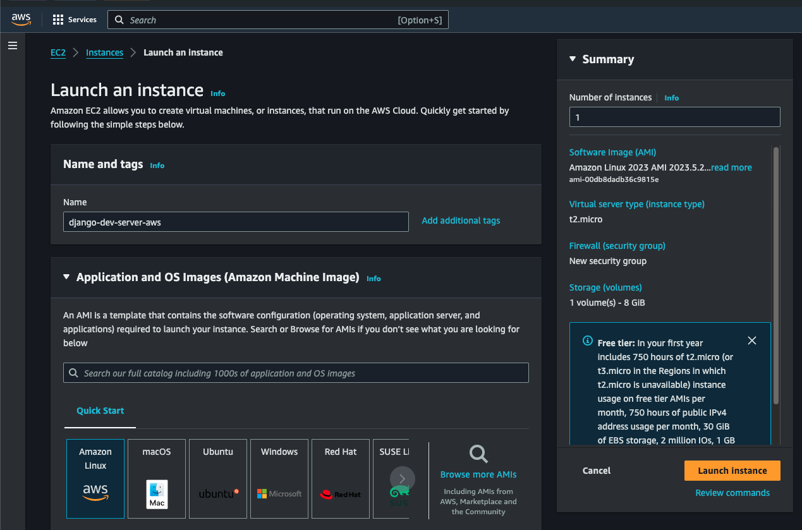

### 2. Allow all SSH, HTTP, HTTPS traffic; launch instance
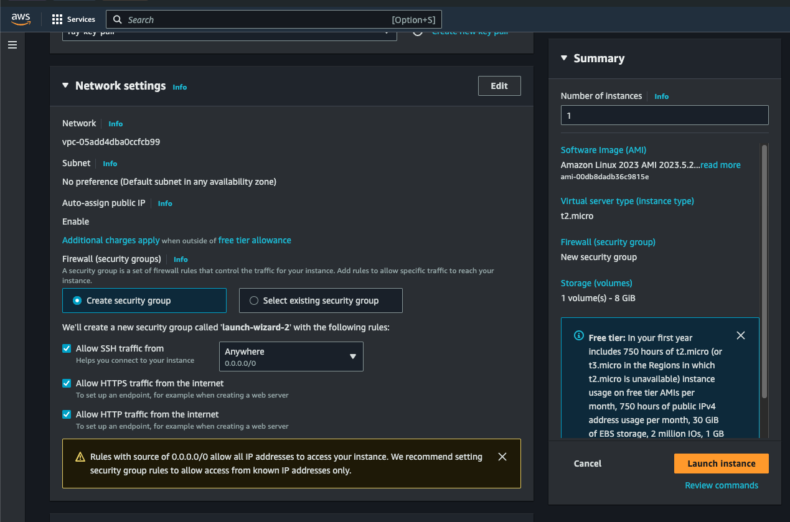

### 3. Open the security group attached to the instance
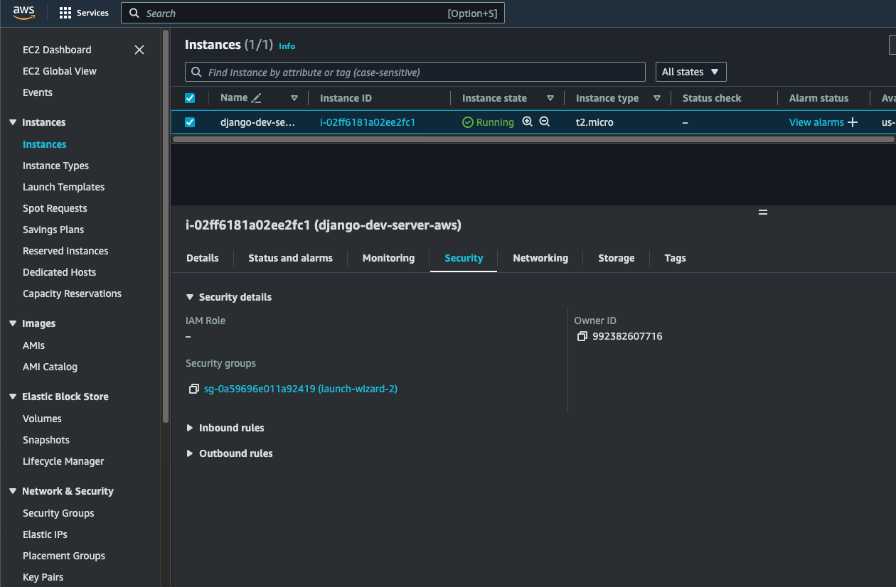

### 4. Click "Edit inbound rules"
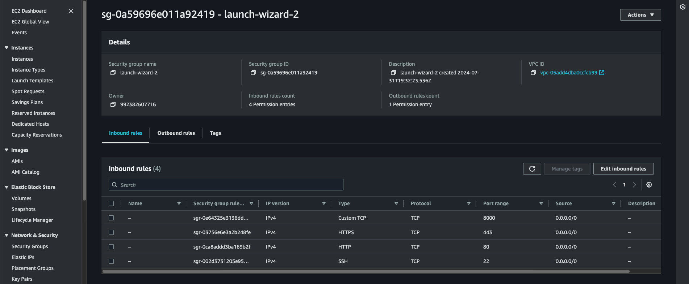

### 5. Add rule to open port 8000 (or whichever port is used) to all traffic
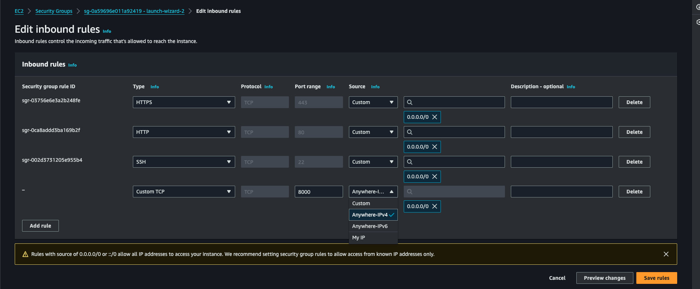

### 6. Open VSCode's Remote Window and select "Connect to Host"
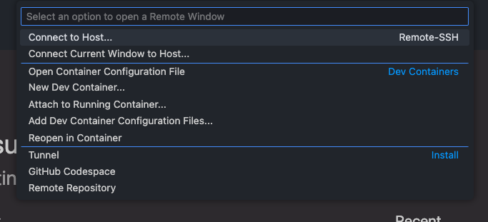

### 7. Select "Configure SSH Hosts"
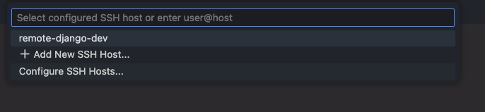

### 8. Select the user ssh config file
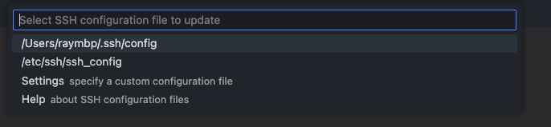

### 9. Add details for connecting to the EC2 instance as such
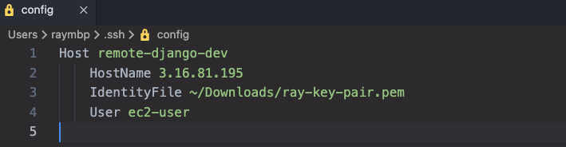

### 10. Verify VSCode connects to the EC2 instance successfully
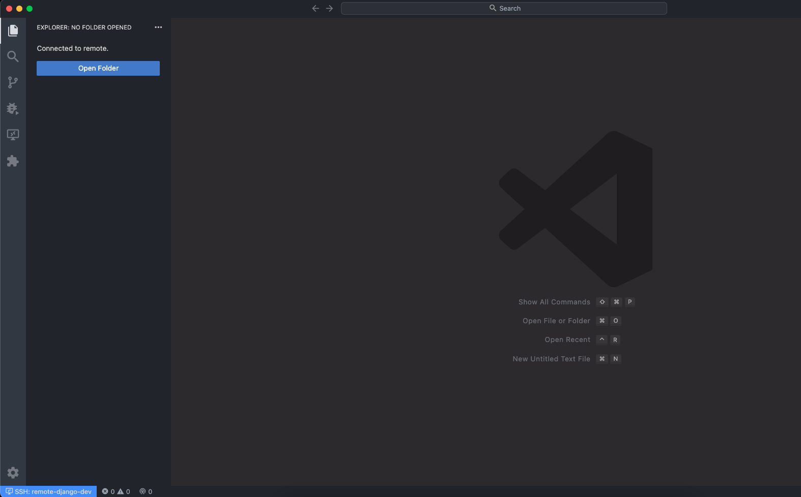

### 11. Clone the project repo; install needed packages
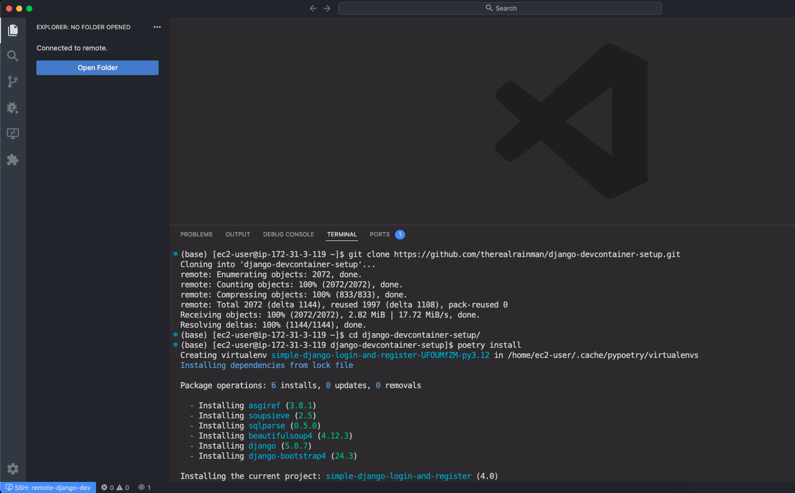

### 12. Start server
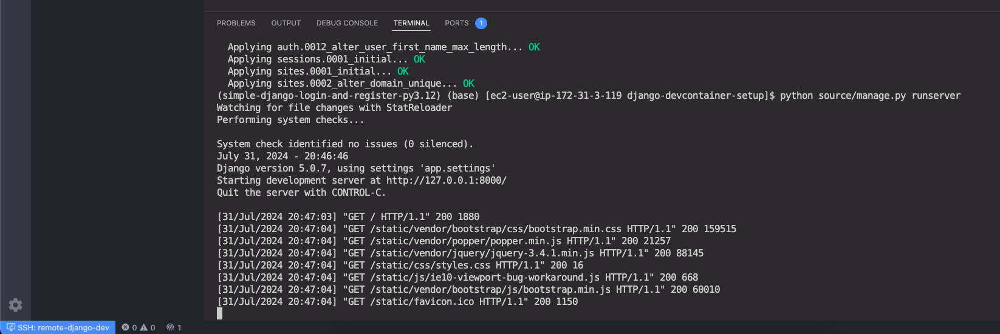

### 13. Browser is able to connect both with localhost or EC2 instance's public IP address
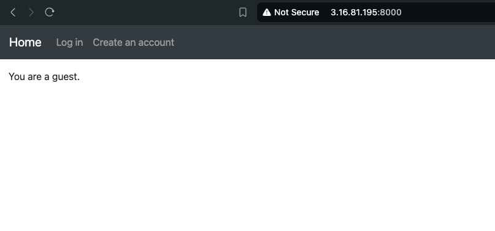
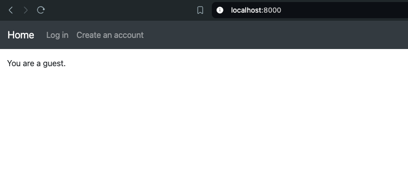

### 14. Open the project folder in VSCode and develop the same as on a local machine
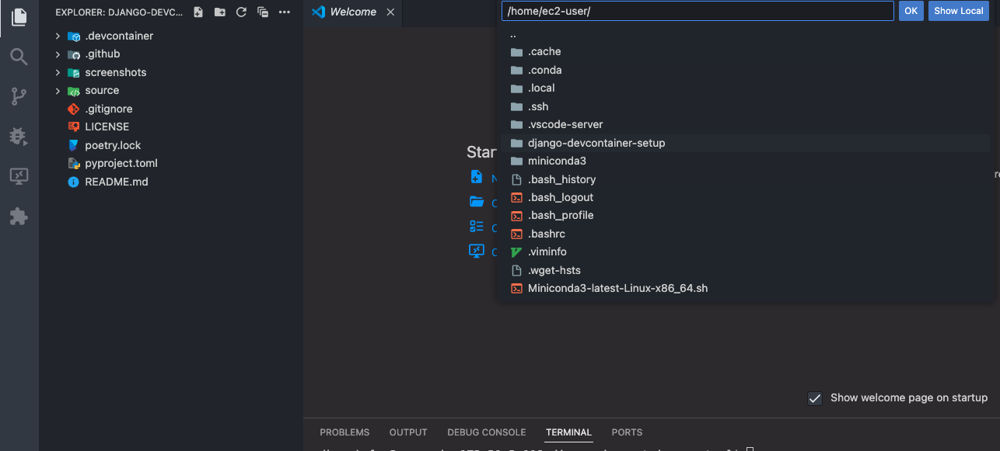
