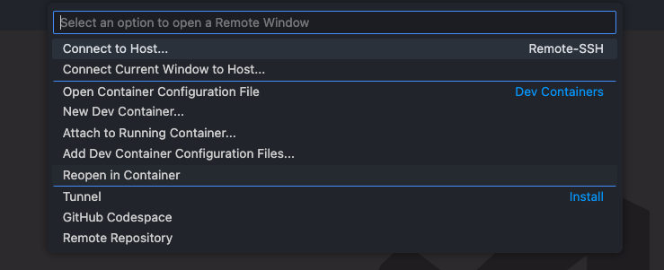
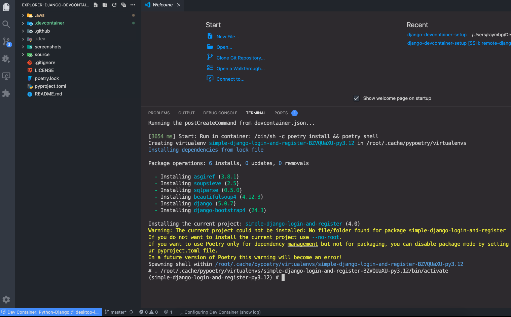
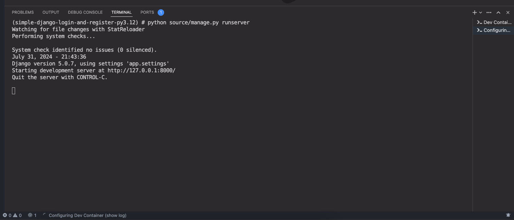
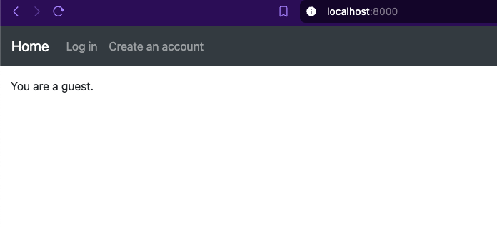
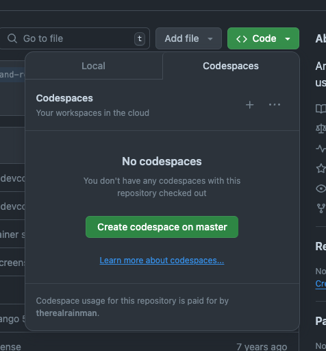
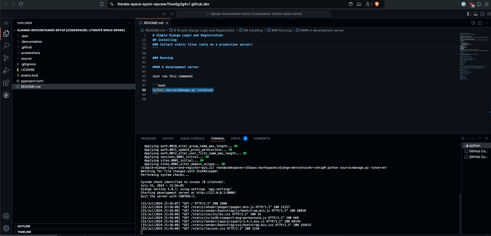
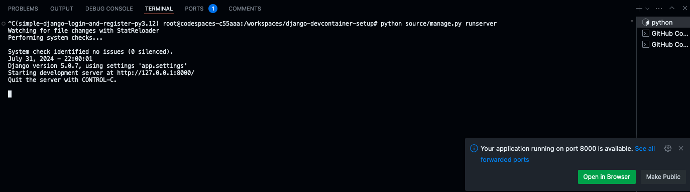
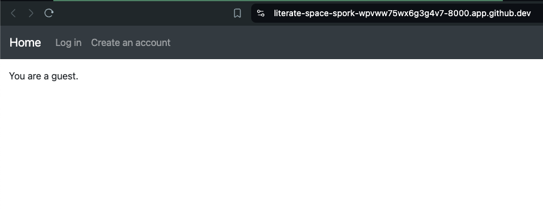

# Remote development on Dev Containers

## Running on a local Docker container
### 1. Open VSCode Remote Window and Select "Reopen in Container"

### 2. Verify the dev container is created and connected

### 3. Develop normally as on a local machine; start runserver in the container

### 4. Verify localhost connection in the browser

## Running on Codespaces
### 1. Open the project's Github page, click clone, click "Codespaces" and create a new codespace

### 2. After the enviroment is created, development can be done in the web browser instance of VSCode

### 3 Run server and click "Open in Browser"

